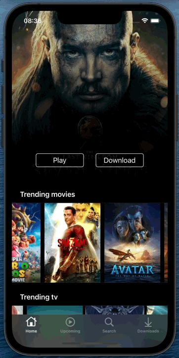

     

<h1 align="center">
  Netflix Clone
</h1> 

<h3 align="center">
  Experimental project created for studies concepts of iOS development
</h3>

## Technologies and Concepts

* UIKit
* ViewCode
* MVVM (Model-View-ViewModel)
* Consuming [The Movie Database API][TMDb] and [YouTube API][yt] with URLSession
* Core Data
* Web View
* Object Oriented Programming
* Design Patterns

<h3 align="center">
<b>Netflix Clone Overview</b>
<h3>
<h1 align="center">
     
</h1>

  <b>Home & Movie Detail:</b> Consuming <a href="https://www.themoviedb.org/settings/api">The Movie Database API</a> to fetch each differents list of movies and load in each corresponding cell and consuming <a href="https://developers.google.com/youtube/v3">YouTube API</a> passing title movie in the query + "Trailer", get the first one and load the video in a Web View using <a href="https://developer.apple.com/documentation/webkit/wkwebview">WKWebView</a> 

<h1 align="center">
     
</h1>

<b>Search:</b> Consuming <a href="https://www.themoviedb.org/settings/api">The Movie Database API</a> to fetch a search query and load results in a UICollectionView

<h1 align="center">
  
</h1>

  

<b>Download:</b> Using <a href="https://developer.apple.com/documentation/coredata">Core Data</a> to persist downloads even if the app closes and reopens

<h1 align="center">
      
</h1>

<b>Upcoming and Delete:</b> Fetching upcoming movies in <a href="https://www.themoviedb.org/settings/api">The Movie Database API</a> and load in a UITableView and deleting movie that was saved in a <a href="https://developer.apple.com/documentation/coredata">Core Data</a> storage 

<h1 align="center">
     
</h1>

[TMDb]: https://www.themoviedb.org/settings/api
[yt]: https://developers.google.com/youtube/v3
[wkwv]: https://developer.apple.com/documentation/webkit/wkwebview

